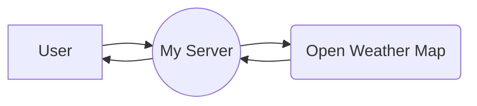

# Weather app

use: 
&emsp;[fastapi](https://fastapi.tiangolo.com/) 
&emsp;[openweathermap.org/api](https://openweathermap.org/api)

```mermaid
graph LR
User[User] --> B((My Server))
B --> C(Open Weather Map)
C --> B
B --> User
```

    uvicorn main:app --reload --host=localhost --port=8000

